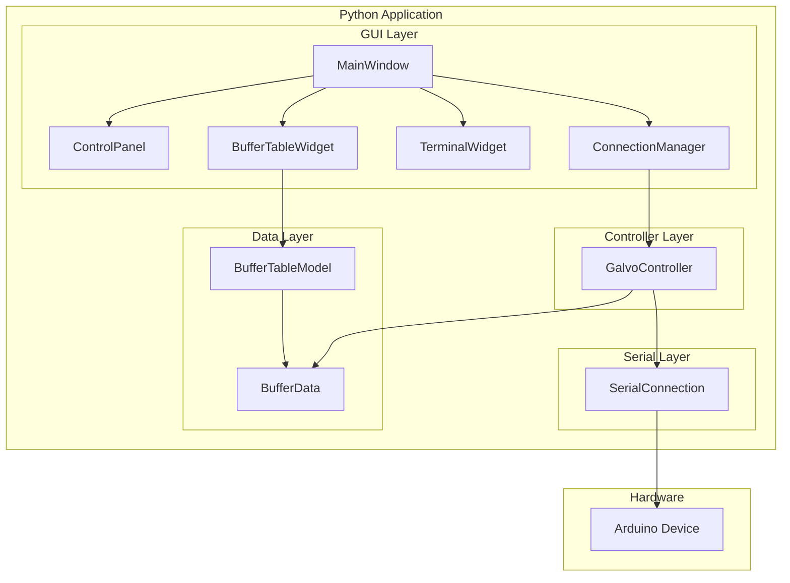
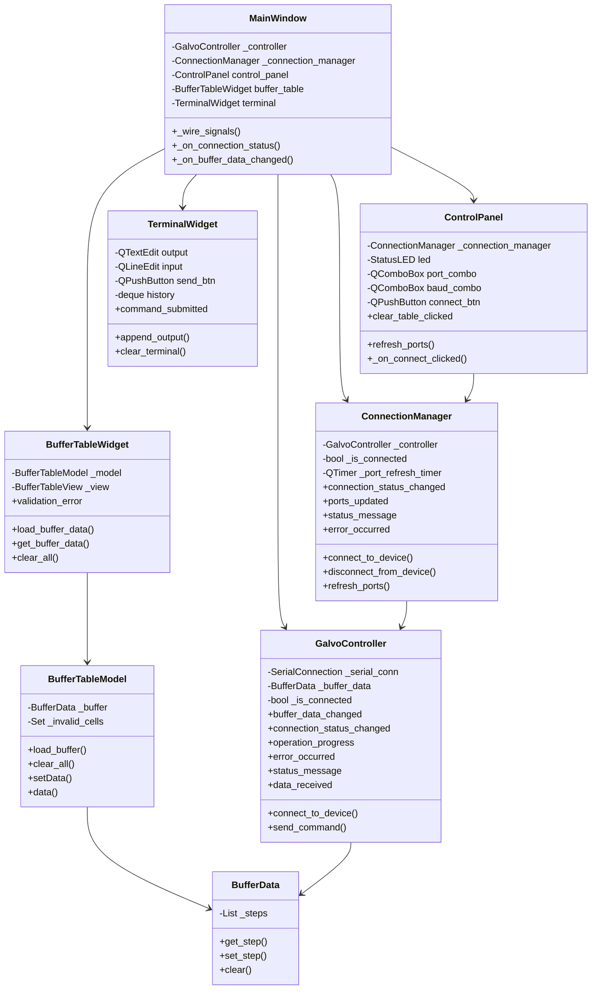
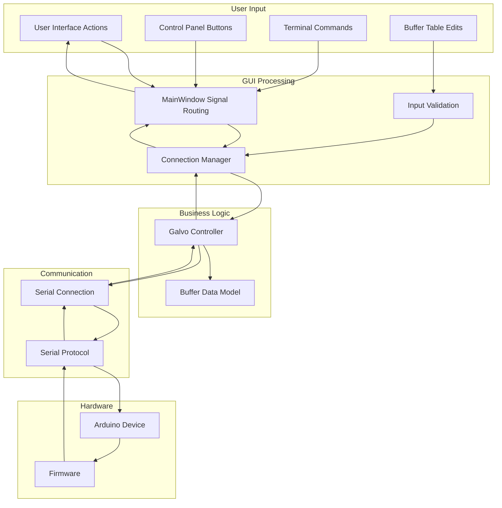
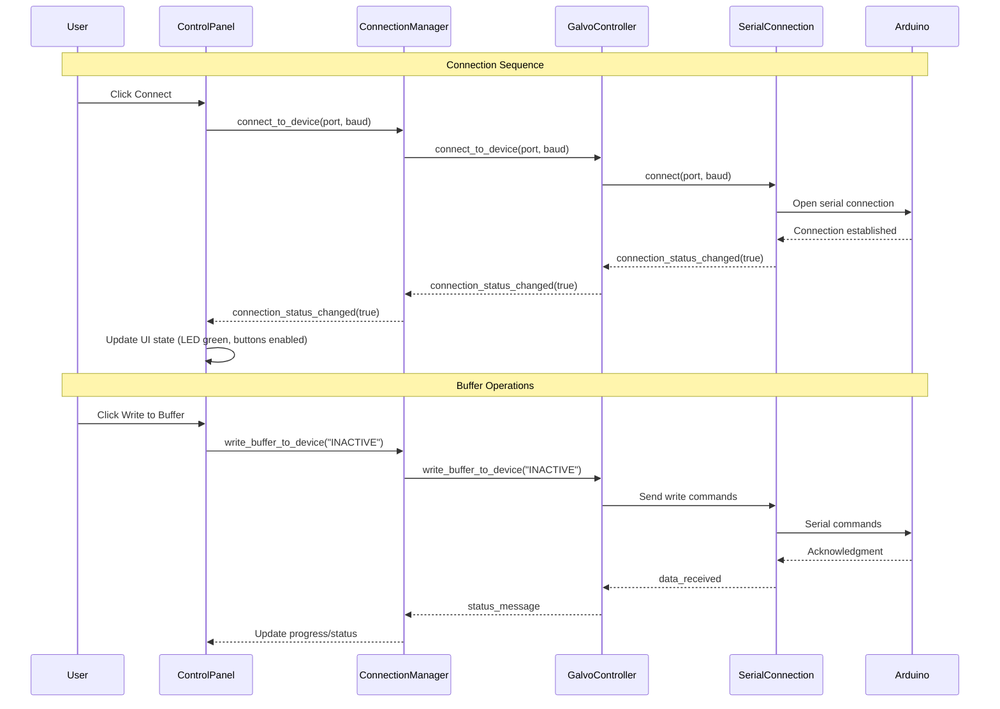
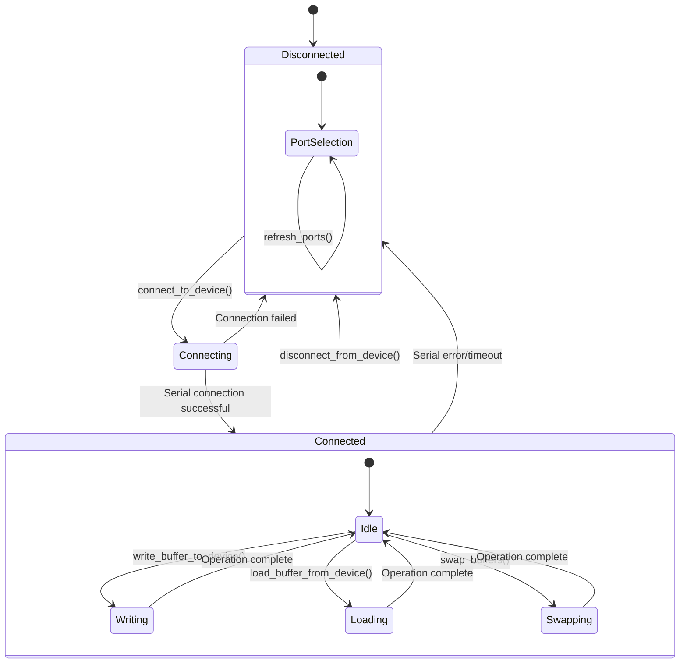
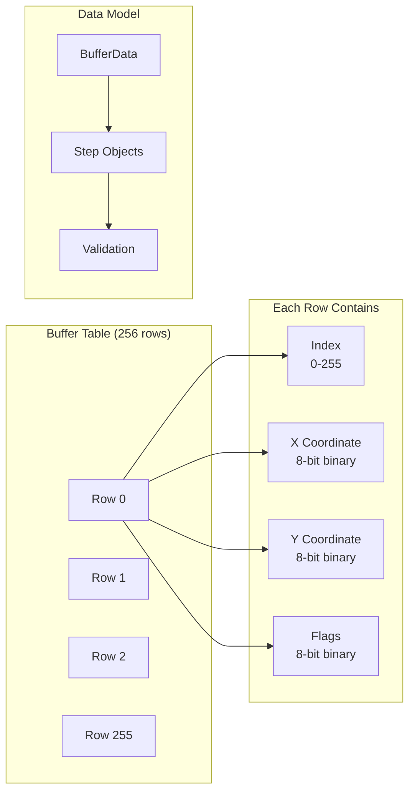
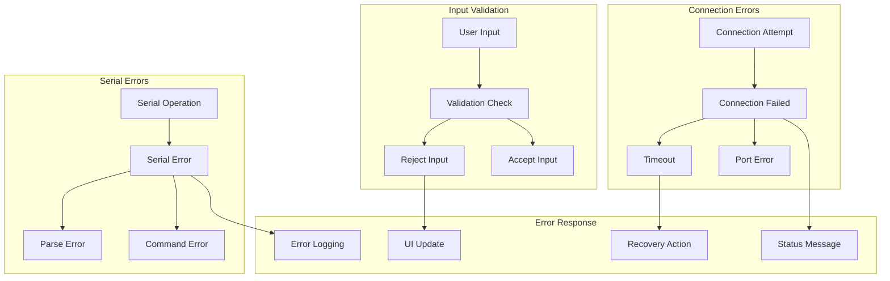
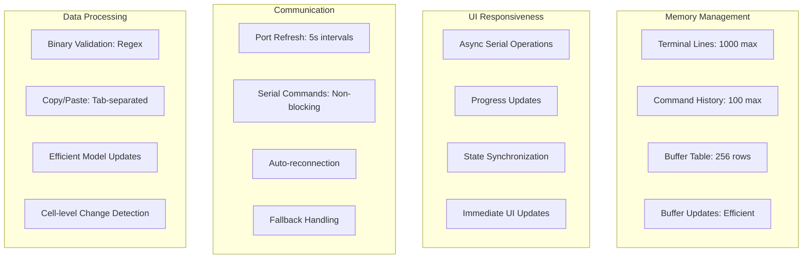
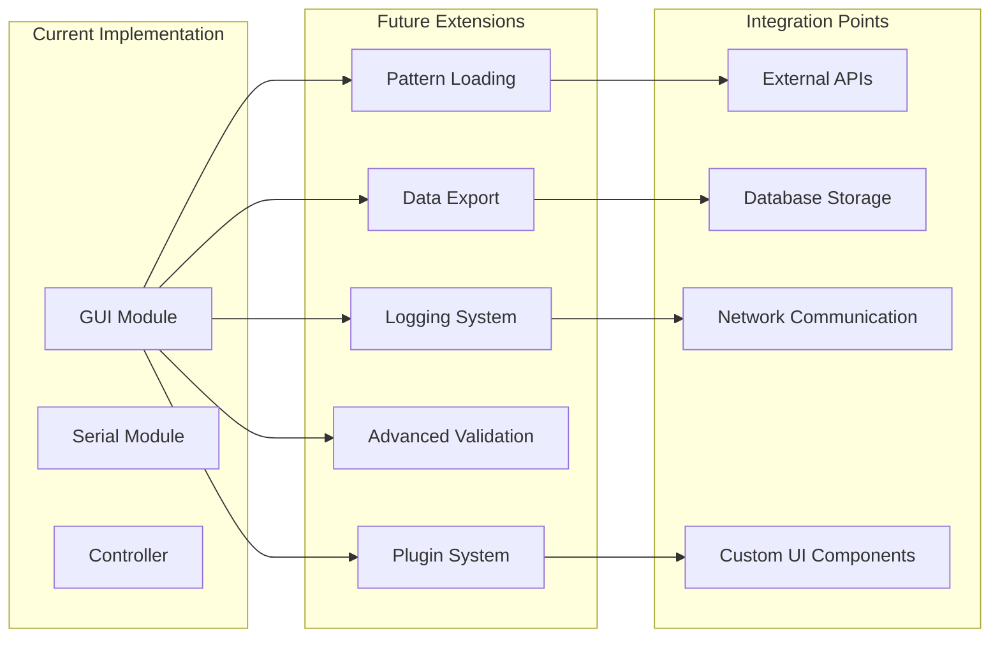
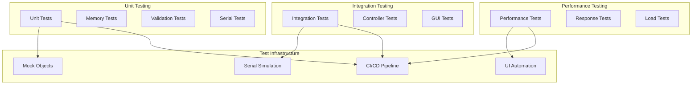

# Galvonium Laser System Architecture

## System Overview

The Galvonium Laser system consists of a Python-based GUI application that communicates with an Arduino device via serial communication. The system is built using a modular architecture with clear separation of concerns between GUI components, business logic, and communication layers.

## High-Level Architecture



## Component Relationships



## Data Flow Architecture



## Signal Communication Flow



## Connection State Machine



## Buffer Data Structure



## Error Handling Flow



## Performance Characteristics



## Extension Points



## Testing Architecture



## Deployment Architecture

```mraph
graph TB
    subgraph "Development Environment"
        DEV[Developer Machine]
        VENV[Virtual Environment]
        DEPS[Dependencies]
        TESTS[Test Suite]
    end

    subgraph "Production Environment"
        PROD[Production Machine]
        PYTHON[Python Runtime]
        QT[PyQt5 Installation]
        SERIAL[pyserial]
    end

    subgraph "Hardware Requirements"
        USB[USB Port]
        AR[Arduino Device]
        LASER[Laser System]
        GALVO[Galvo Mirrors]
    end

    DEV --> VENV
    VENV --> DEPS
    DEPS --> TESTS

    PROD --> PYTHON
    PYTHON --> QT
    PYTHON --> SERIAL

    PROD --> USB
    USB --> AR
    AR --> LASER
    LASER --> GALVO
```

This architecture documentation provides a comprehensive view of your Galvonium Laser system, showing how all the components interact, how data flows through the system, and where the extension points are for future development.
